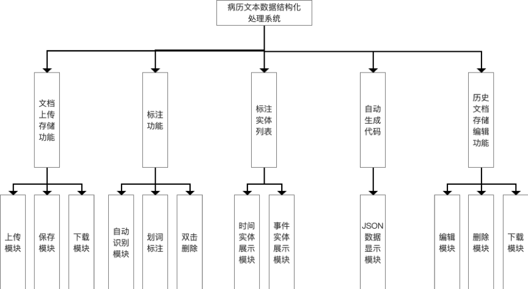

# Data-Annotations
数据标注系统
## 主要技术：
前端：
1. annotator插件
2. element-ui
3. vue.js
    
后端：
1. SSM

训练模型：
1. CRF++
2. python
## 界面效果图

## 功能模块图

## 其他
1. 自动训练处只在前后端预留了接口，具体实现逻辑以及增量训练的数据处理未完成
2. 需要在后端 /SSM/CrfPro/src/main/Java/com/cm/common/FilesMethod.java 处修改文件保存路径，以及模型加载路径
3. 界面内数据均来自于数据库动态加载
4. 代码丑陋，仅供实验室自娱自乐
5. 有事咨询邮箱 865212941@qq.com

